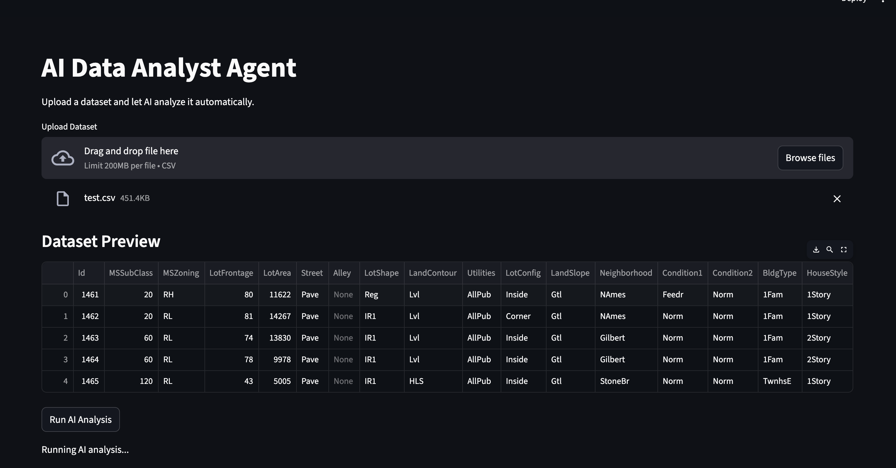
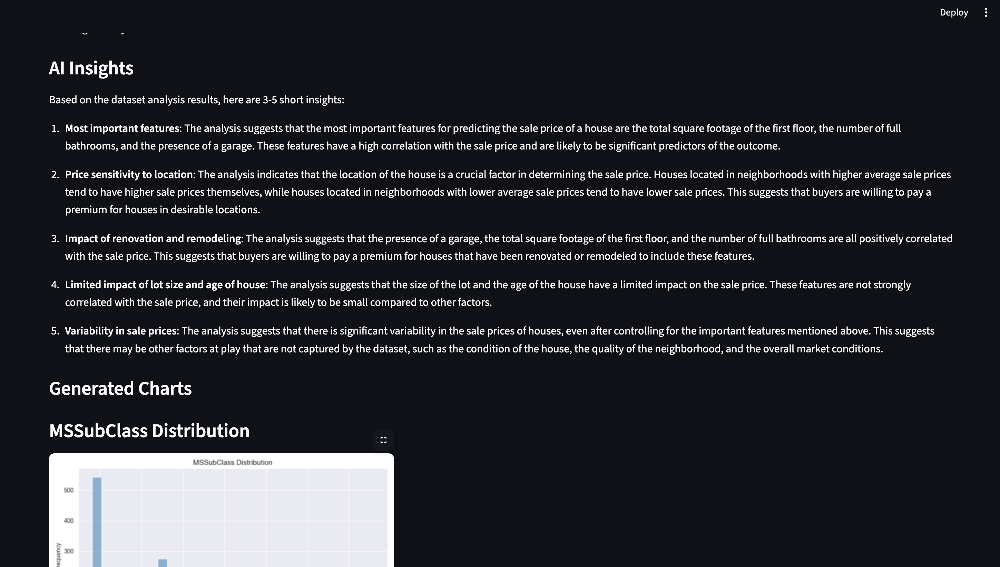
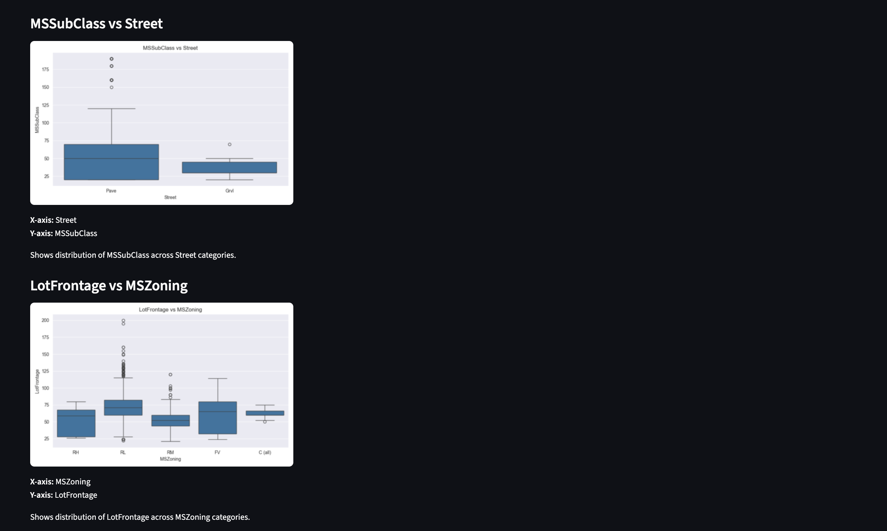
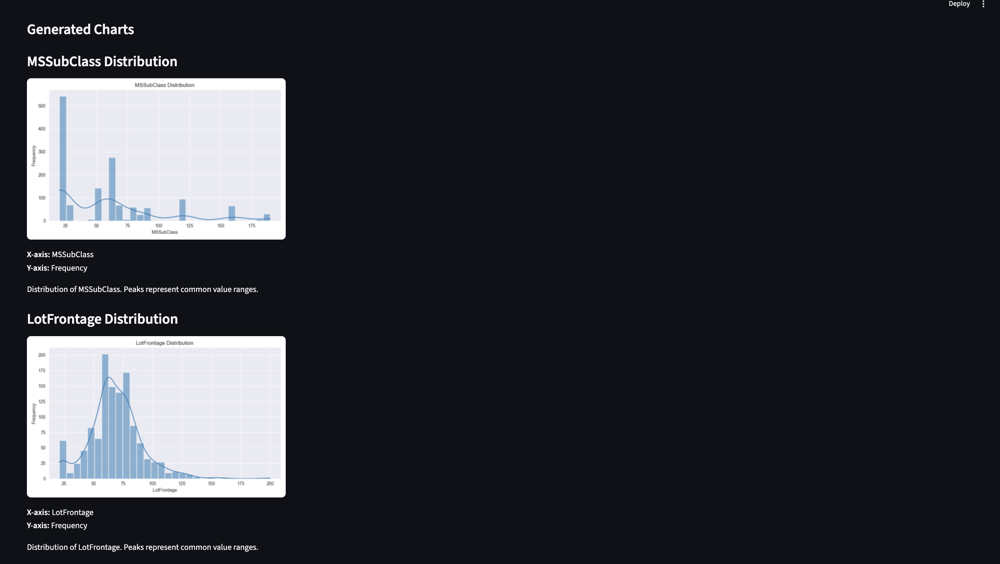
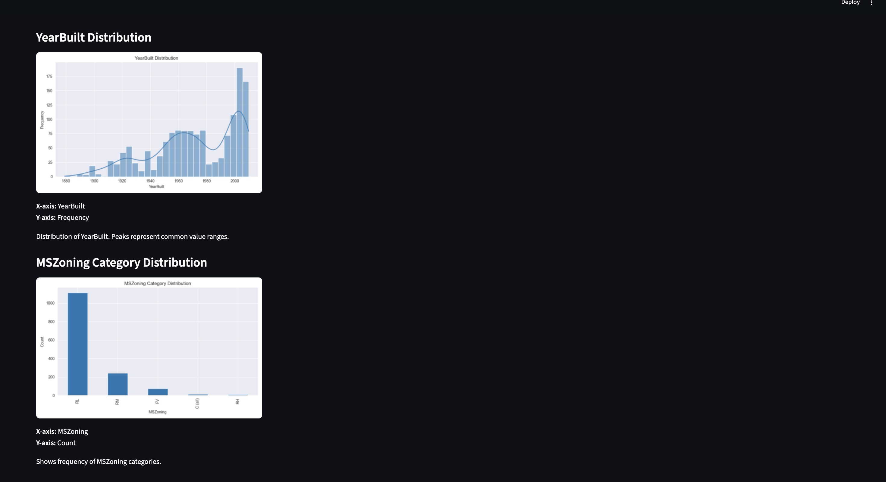
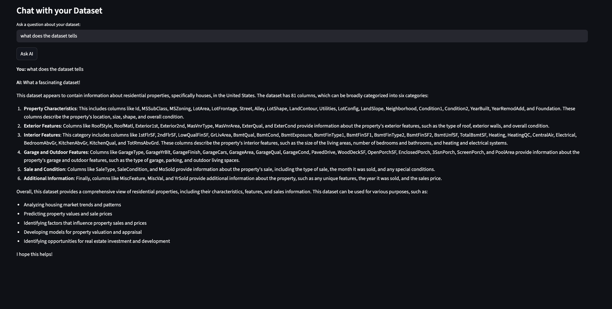
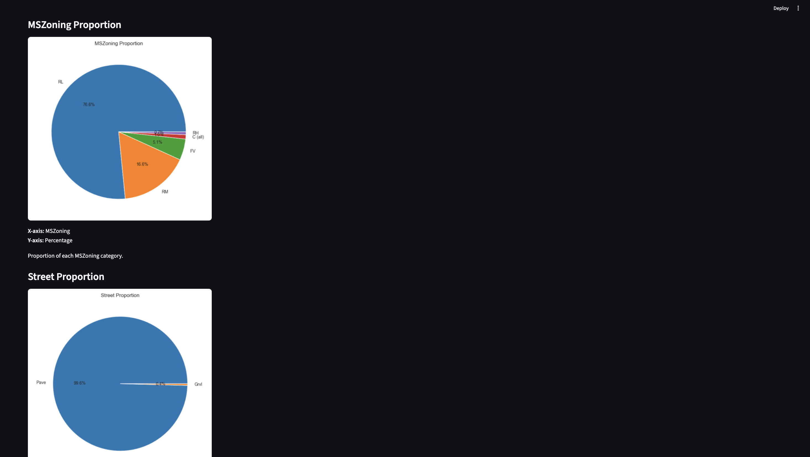

# AI Data Analyst Agent

An **AI-powered data analysis platform** that allows users to upload datasets, automatically generate insights, visualize relationships, and interact with the data through a conversational AI interface.

This project combines **Large Language Models (LLMs), AI agents, automated exploratory data analysis (EDA), and vector search** to build an intelligent system capable of performing analytics tasks similar to modern business intelligence tools.

---

# Project Demo

## Application Interface
<p align="center">
  
</p>

## Dataset Preview
<p align="center">
  
</p>

## AI Generated Insights
<p align="center">
  
</p>

## Generated Charts
<p align="center">
  
</p>

## Visualization Outputs
<p align="center">
  
</p>

## Conversational Chat Interface
<p align="center">
  
</p>

## Visualization Outputs
<p align="center">
  
</p>

---

# Features

- Upload datasets and automatically analyze them  
- Generate automated charts and visualizations  
- Detect correlations between variables  
- Produce AI-generated insights from datasets  
- Conversational chatbot for dataset queries  
- Generate charts directly from natural language queries  
- Export processed datasets for Tableau dashboards  
- Modular multi-agent architecture  
- Retrieval Augmented Generation (RAG) support  

---

# Technologies Used

- Python  
- Streamlit  
- LangChain  
- LangGraph  
- ChromaDB (Vector Database)  
- Ollama (Local LLM)  
- Pandas  
- Matplotlib  
- Seaborn  

---

## Project Architecture

```text
User
 │
 ▼
Streamlit Interface (UI)
 │
 ▼
LangGraph Orchestrator
 │
 ▼
AI Agents
 ├── Data Agent
 │     └── Performs exploratory data analysis
 │
 ├── Visualization Agent
 │     └── Generates charts automatically
 │
 ├── Insight Agent
 │     └── Produces AI-generated insights
 │
 └── Chat Agent
       └── Handles natural language queries
 │
 ▼
MCP Tool Layer
 │
 ▼
Analytics Tools
 ├── Data Analysis Tool
 ├── Visualization Tool
 ├── RAG Search Tool
 └── Tableau Export Tool
 │
 ▼
Vector Database
ChromaDB
 │
 ▼
LLM
Ollama (Local Large Language Model)
```

---

## Project Structure

```text
ai-data-analyst-agent
│
├── agents
│   ├── chart_agent.py
│   ├── chat_agent.py
│   ├── data_agent.py
│   ├── insight_agent.py
│   ├── orchestrator_agent.py
│   ├── rag_agent.py
│   └── viz_agent.py
│
├── tools
│   ├── data_analysis_tool.py
│   ├── visualization_tool.py
│   ├── rag_search_tool.py
│   └── tableau_export_tool.py
│
├── rag
│   ├── document_loader.py
│   ├── embeddings.py
│   └── vector_store.py
│
├── models
│   └── ollama_client.py
│
├── graph
│   └── agent_graph.py
│
├── mcp
│   └── mcp_server.py
│
├── app
│   └── streamlit_app.py
│
├── assets
│   ├── 1.png
│   ├── 2.png
│   ├── 3.png
│   ├── 4.png
│   ├── 5.png
│   ├── 6.png
│   └── 7.png
│
├── config
│   └── settings.py
│
├── data
│   └── docs
│
├── requirements.txt
└── README.md
```

# How It Works

### 1 Upload Dataset
Users upload a CSV dataset through the Streamlit interface.

### 2 Automated Analysis
The **DataAgent** performs exploratory data analysis including:

- dataset summary  
- statistical metrics  
- column structure analysis  

### 3 Visualization Generation
The **VisualizationAgent** automatically detects data types and generates charts such as:

- Histograms  
- Scatter plots  
- Category distributions  
- Correlation heatmaps  

### 4 Insight Generation
The **InsightAgent** uses a Large Language Model to generate meaningful insights from the dataset.

### 5 Conversational Data Analysis
Users can interact with the dataset using natural language queries.


---

# Example Workflow

1. Upload a dataset  
2. Click **Run AI Analysis**  
3. Review generated charts and insights  
4. Ask questions about the dataset through the chatbot  

---

# Installation

## 1. Clone the Repository

```bash
git clone https://github.com/gaurimk/ai-data-analyst-agent.git
cd ai-data-analyst-agent
```

---

## 2. Create Virtual Environment

```bash
python -m venv venv
source venv/bin/activate
```

For Windows:

```bash
venv\Scripts\activate
```

---

## 3. Install Dependencies

```bash
pip install -r requirements.txt
```

---

# Running the Application

Start the Streamlit application:

```bash
streamlit run app/streamlit_app.py
```

Open the application in your browser:

```
http://localhost:8501
```

---

# Use Cases

- Automated exploratory data analysis  
- AI-powered business intelligence  
- Conversational analytics  
- Data exploration for non-technical users  
- AI-assisted dashboard preparation  

---

# Future Improvements

- Support for larger datasets  
- Natural language to SQL queries  
- Advanced chart recommendation system  
- Real-time data streaming  
- Integration with additional BI tools  

---

# Author

**Gauri Mahadev**

GitHub:  
https://github.com/gaurimk

